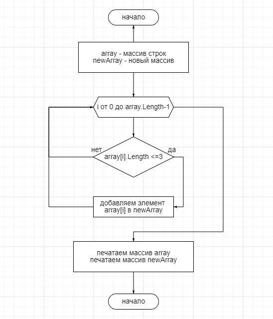

### Постановка задачи:

Из имеющегося массива строк(array) сформировать новый массив строк(newArray), длина которых меньше либо равна 3.
### Изначальные условия:

Первоначальный массив строк(array) задается в программе.

### Последовательность действий:

1. В массиве array считаем количество элементов, длина которых <= 3 (N).
2. Создаем новый массив строк newArray размером N.
3. Заполняем массив newArray элементами из array, длина которых <=3.
4. Выводим содержимое массивов array и newArray в консоль.

Первоначальный массив строк задается в программе.

### Используемые функции:

***GetElementsLenCount()*** - считает количество элементов массива указанной длины
- **аргументы**: массив строк, длина отбираемых элементов
- **возвращаемое значение**: количество элементов массива указанной длинны

***FillNewArray()*** - из изначального массива копирует элементы указанной длины в новый массив
- **аргументы**: изначальный массив строк, новый массив, длина отбираемых элементов

***PrintArrayStr()*** - выводит содержимое массива строк на экран
- **аргументы**: массив строк, сопровождающее сообщение, разделитель

### Блок-схема алгоритма решения:

